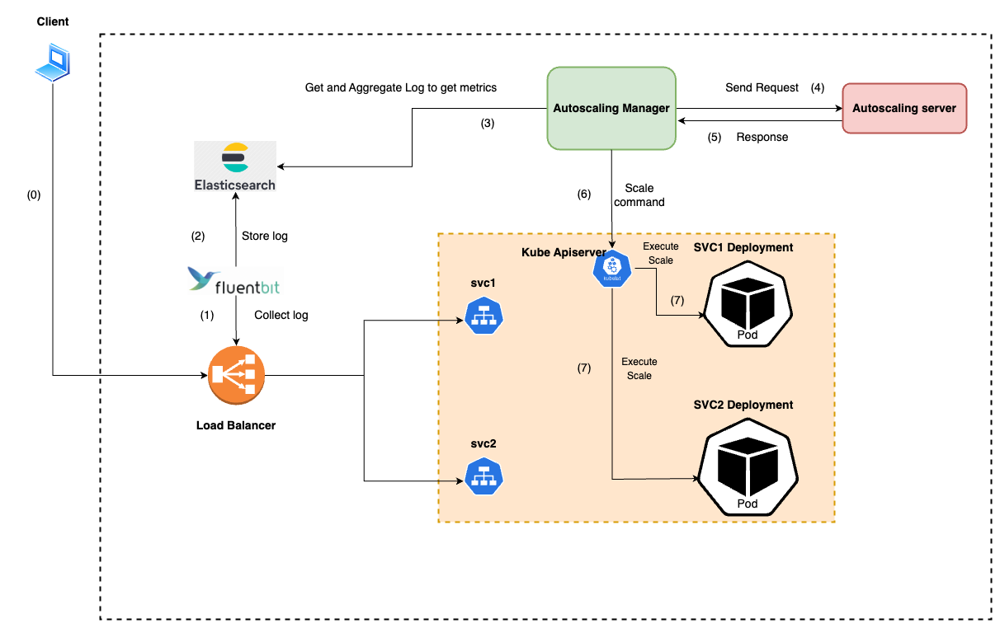

# ProactiveAutoscaling
[](https://sonarcloud.io/summary/new_code?id=PhamMinhHiepIT2_ProactiveAutoscaling)

## System Architecture


## Train model

```bash
python train.py --model_type=lstm --data_type=fifa --units=128 --epochs=200 --batch=16 --patience=10 --load_percent=100
```

## Train multistep model

```bash
python train_multistep.py --model_type=bilstm --data_type=fifa --units=128 --epochs=200 --batch=16 --patience=10 --load_percent=100
```
